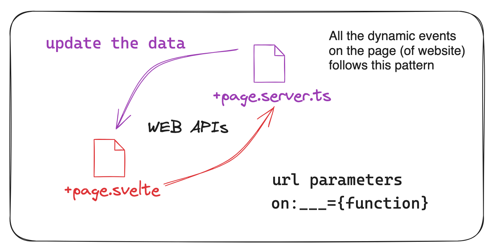

# Project 2: Routing 

Fei Wang (Michael) :heart: AI

HyperGI

Github: [oceanumeric](https://github.com/oceanumeric)


---


# Show Cases 


---

# Inspiration

<iframe width="560" height="315" src="https://www.youtube.com/embed/G-tafjJzfQo?si=94-mOj-lTAo1PxcT&amp;start=64" title="YouTube video player" frameborder="0" allow="accelerometer; autoplay; clipboard-write; encrypted-media; gyroscope; picture-in-picture; web-share" allowfullscreen></iframe>

<br>

<a href="https://youtu.be/G-tafjJzfQo?si=kcouIhrSswZfAq5q" target="_blank">YouTube Link</a>


--- 

# Key Concepts

Our website needs to respond to different URLs and render different content based on the URL dynamically.

- `/` : Home Page
- `/about` : About Page
- `/users` : Users Page
- `/products` : Products Page
- `/songs` : Songs Page


---

# Key Concepts

- `+page.svelte` : Page Component
- `+page.ts` : load some data before it can be rendered
- `+page.server.ts` : server-side rendering (without exposing the endpoint to the client)
- `+layout.svelte` : Layout Component (e.g. Navbar, Footer) via `slot`

<br>

<a href="https://kit.svelte.dev/docs/routing" target="_blank"> SvelteKit Docs </a>


---

# All requests are done by URL

- `http://localhost:5173/`: Home Page
- `http://localhost:5173/about`: slug = `about`
- `http://localhost:5173/?page=2`: query = `page=2` (search, searchParams)


---

# Example: DummyJSON

```
https://dummyjson.com/products?limit=10&skip=10
```

<br>

<a href="https://dummyjson.com/products?limit=10&skip=10" target="_blank"> DummyJSON </a>

<br>

> Application Development = User Interface + Data + Logic

---


---

# URL in SvelteKit

```js
// +page.server.ts
import type { PageServerLoad } from './$types';

export const load:PageServerLoad = (async ({ url }) => {
    console.log('page.server.ts load', url);
    console.log('URL search params', url.searchParams);
    return {};
});
```


---

```bash
2:33:47 PM [vite] page reload src/routes/+page.server.ts (x3)
page.server.ts load URL {
  href: 'http://localhost:5173/',
  origin: 'http://localhost:5173',
  protocol: 'http:',
  username: '',
  password: '',
  host: 'localhost:5173',
  hostname: 'localhost',
  port: '5173',
  pathname: '/',
  search: '',
  searchParams: URLSearchParams {},
  hash: ''
}
```


---

# Knowing Json Keys is Important

- many `json` files are nested
- keep track of the keys
- keys have to be consistent
- `json` keys are case-sensitive
- `json` keys are like `dict` keys in Python


---


--- 

## Tips

```js
// +page.server.ts
console.log(data)
// +page.svelte
{JSON.stringify(data, null, 2)}
```

---

```js
import type { PageServerLoad } from './$types';
import { error } from '@sveltejs/kit';

export const load:PageServerLoad = (async ({ url }) => {

    // in case user enters a string instead of a number
    const limit = Number(url.searchParams.get('limit')) || 10;
	const skip = Number(url.searchParams.get('skip')) || 0;

    if (limit > 100) {
        throw error(404, 'limit must be less than 100')
    }
    
    // function to get data from API
    async function getUsers(limit: number=10, skip: number=0) {
        const res = await fetch(`https://dummyjson.com/users?limit=${limit}&skip=${skip}`);
        const data = await res.json();
        return data;
    }

    return {
        severData: await getUsers(limit, skip)
    };
});
```


---

```js
<script lang="ts">
    import type { PageData } from './$types';
    export let data: PageData;

    let pageSize = 10;
    let totalItems = data.severData.total;
    let totalPages = Math.ceil(totalItems / pageSize);
</script>
```


---




---

# Loading Data

- One page for each product
- `+page.svelte` is dynamicallly rendered

<br>

<a href="https://kit.svelte.dev/docs/load#using-url-data" target="_blank">SvelteKit Docs</a>

---

# Loading Data

```bash
# within the src folder
.
├── app.css
├── app.d.ts
├── app.html
├── lib
│   └── index.ts
└── routes
    ├── +layout.svelte
    ├── +page.svelte
    ├── products
    │   ├── [id] # could be any name, e.g. [slug] or [productId]
    │   ├── +page.server.ts
    │   └── +page.svelte
    └── users
        ├── +page.server.ts
        └── +page.svelte
```

> `[id]` again is the key of an object


---

# Loading Data

```bash
.
├── app.css
├── app.d.ts
├── app.html
├── lib
│   └── index.ts
└── routes
    ├── +layout.svelte
    ├── +page.svelte
    ├── products
    │   ├── [id]
    │   │   ├── +page.server.ts  # talk to database and load data
    │   │   └── +page.svelte   # render the page
    │   ├── +page.server.ts
    │   └── +page.svelte
    └── users
```

---

# URL Data and Page Data

```js
import type { PageServerLoad } from './$types';
import { error } from '@sveltejs/kit';


export const load:PageServerLoad = (async ({ url, params }) => {
    console.log(url);  // URL object
    console.log(params);  // page data
})
```

<br>

<a href="https://kit.svelte.dev/docs/load#page-data" target="_blank"> SvelteKit Docs </a>


---

```bash
# url data via url
URL {
  href: 'http://localhost:5173/products/2',
  origin: 'http://localhost:5173',
  protocol: 'http:',
  username: '',
  password: '',
  host: 'localhost:5173',
  hostname: 'localhost',
  port: '5173',
  pathname: '/products/2',
  search: '',
  searchParams: URLSearchParams {},
  hash: ''
}
# page data via params
{ id: '2' }
```