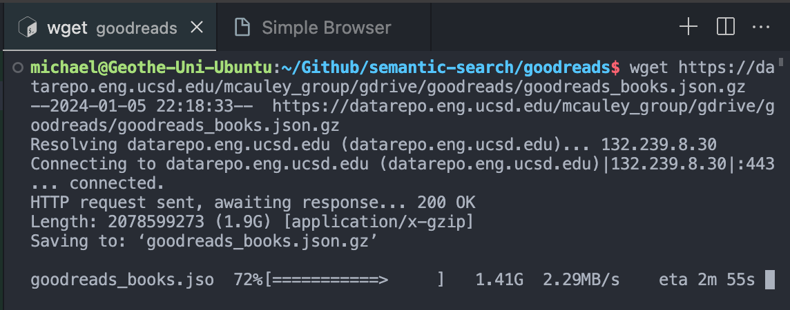
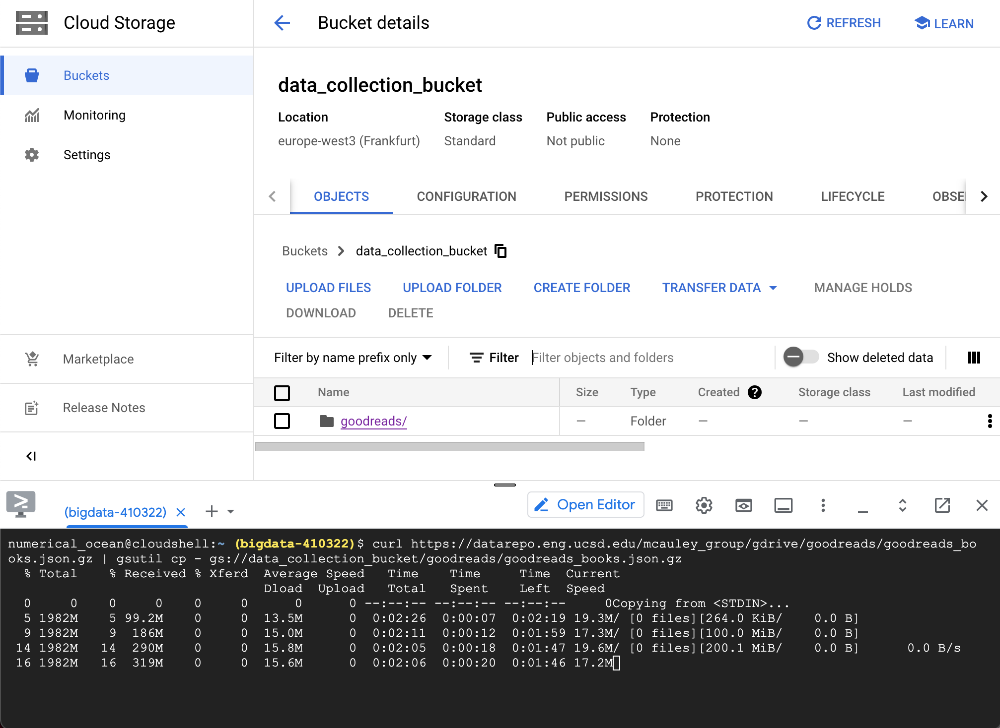

# Project 4: Big Data Analytics in the era of AI

Fei Wang (Michael) :heart: AI

HyperGI

Github: [oceanumeric](https://github.com/oceanumeric)

---

# What we have learned so far

- Frontend
    - Server-side rendering and client-side rendering
    - Sveltekit and FastAPI
    - Sveltekit Form Actions

--- 

# What we will cover in the future

- Section II: Backend
    - data preprocessing
    - understanding the data
    - tran an ML model

- Section III: Connecting frontend and backend
    - API
    - Deploying the app to the cloud

---

# You will learn a lot in the end of this course :high_brightness:

--- 

# Our goal: semantic search based on content rather than keywords

---

# Our dataset: Goodreads Book Graph Datasets

- <a href="https://mengtingwan.github.io/data/goodreads.html" target="_blank"> Goodreads Book Graph Datasets</a>
- <a href="https://www.goodreads.com/book/show/14318.Chronicles_Volume_One" target="_blank"> Goodreads Example</a>

- Total size: + 10GB (compressed); + 50GB (uncompressed)
- Number of books: 2.36M
- It can be called a big data project

---

# Data Engineering 101: the core

---

# Data Engineering 101: the core

---

# Data Engineering 101: modern data stack

---

# Data Engineering 101: modern data stack

---

# Data Engineering 101: too many tools

---

# How to navigate the modern data stack?

---

---

---

# Navigate the modern data stack

- You cannot speed up the data flow if you have to move the data from one tool to another
    - especially when the data is big
    - and it has to travel through the internet
- The top rule is to use less tools
    - with one more tool,
        - you have to learn it
        - you have to move the data to it

---

# Navigate the modern data stack

---

# Navigate the modern data stack

---

